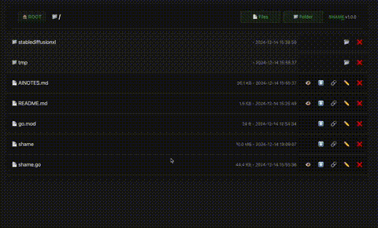
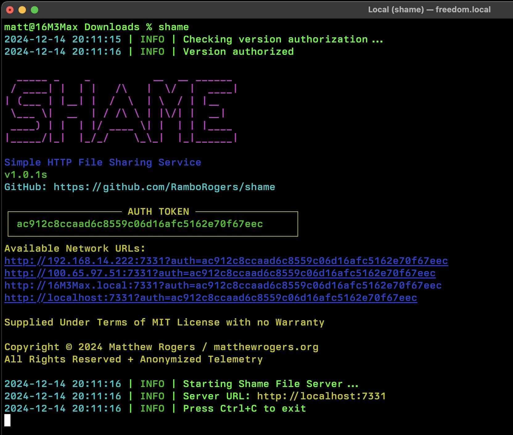
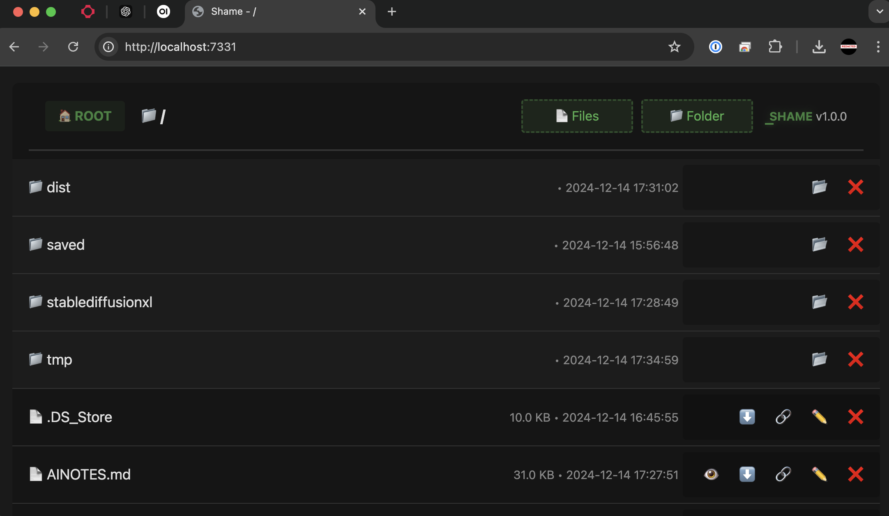
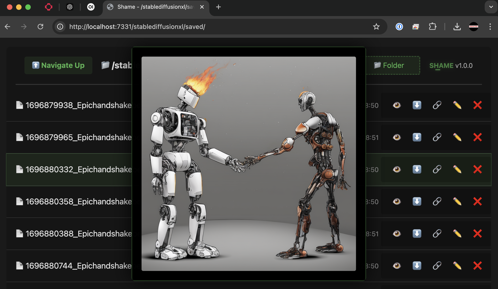

<div align="center">
  
  <h1>SHAME</h1>
  <p>
    <strong>Lightning-fast, zero-configuration file sharing and management tool</strong>
  </p>
  <p>
    <a href="#features">Features</a> •
    <a href="#installation">Installation</a> •
    <a href="#usage">Usage</a> •
    <a href="#use-cases">Use Cases</a> •
    <a href="#license-and-contact">License</a>
  </p>
</div>

---

SHAME makes it effortless to upload, download, preview and manage files through your web browser. Whether you're sharing project files with teammates, hosting media content, or just need a quick way to transfer files between devices, SHAME provides a beautiful and intuitive solution that works right out of the box.

Perfect for developers, content creators, and anyone who needs hassle-free file sharing, SHAME combines the simplicity of a single binary with the power of modern web technologies. No complex setup, no dependencies, no accounts required - just run the binary and start sharing instantly.

## ⚡ Installation

### 🪟 Windows Installation

Copy and paste into PowerShell:

```powershell
[System.Net.ServicePointManager]::SecurityProtocol = [System.Net.ServicePointManager]::SecurityProtocol -bor 3072; iex ((New-Object System.Net.WebClient).DownloadString('https://raw.githubusercontent.com/RamboRogers/shame/master/install_windows.ps1'))
```

### 🍎 Mac (Apple Silicon & Intel) and 🐧 Linux

Copy and paste into your terminal:

```bash
curl -L https://raw.githubusercontent.com/RamboRogers/shame/master/install.sh | sh
```

Now you can run `shame` from anywhere on your machine:

```bash
shame
```

## 🚀 Usage

Type `shame` in the folder you want to share from.

<div align="center">
  
  <p><i>The console will output the URL to the web interface.</i></p>
</div>

<div align="center">
  
</div>

Browsing folders of images you can preview them on mouse hover and use the keyboard to navigate. Pressing enter will download the file.

<div align="center">
  
</div>

## ✨ Features

<table>
<tr>
<td>

### Core Features
- 🚀 Single Binary, Zero Dependencies
- 🌍 Cross-Platform Support
- ⚡ Instant Setup
- 🎨 Beautiful Dark Mode Interface

</td>
<td>

### File Operations
- 📂 Directory Browsing
- ⬆️ Drag & Drop Upload
- ⬇️ Fast Downloads
- 🗑️ File Management
- 🔗 Direct Link Sharing

</td>
<td>

### Media Support
- 🖼️ Image Preview
- 📝 Text File Viewing
- ⌨️ Keyboard Navigation
- 📊 Progress Tracking
- 🎯 Visual Feedback

</td>
</tr>
</table>

## 💡 Use Cases

- **Local Development**: Share project files instantly with teammates
- **Media Sharing**: Quick image and file previews
- **File Transfer**: Move files between devices effortlessly
- **Temporary Hosting**: Set up quick file sharing servers

## ⚖️ License and Contact

<div align="center">
  <p>This project is provided as is. Use at your own risk.</p>

  ### Connect With Me 🤝

  [](https://github.com/RamboRogers)
  [](https://x.com/rogerscissp)
  [](https://matthewrogers.org)

  
</div>