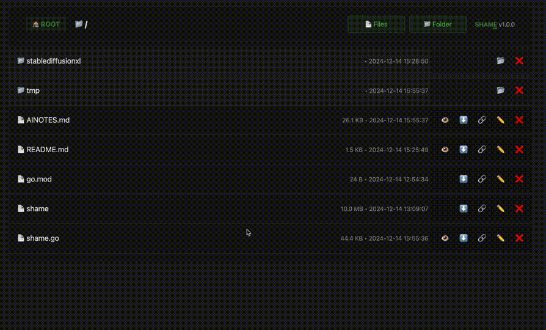

# SHAME

SHAME is a lightning-fast, zero-configuration file sharing and management tool that lets you instantly share files and folders from any directory. With its sleek dark mode interface and powerful features, SHAME makes it effortless to upload, download, preview and manage files through your web browser. Whether you're sharing project files with teammates, hosting media content, or just need a quick way to transfer files between devices, SHAME provides a beautiful and intuitive solution that works right out of the box.

Perfect for developers, content creators, and anyone who needs hassle-free file sharing, SHAME combines the simplicity of a single binary with the power of modern web technologies. No complex setup, no dependencies, no accounts required - just run the binary and start sharing instantly.


## Installs on Your Machine in Seconds ⚡

### Windows Installation 🪟

Copy and paste into PowerShell:

```powershell
[System.Net.ServicePointManager]::SecurityProtocol = [System.Net.ServicePointManager]::SecurityProtocol -bor 3072; iex ((New-Object System.Net.WebClient).DownloadString('https://raw.githubusercontent.com/RamboRogers/shame/master/install_windows.ps1'))
```


### Apple Silicon (M1/M2/M3) & Intel Mac 🍎 and Linux 🐧

Copy and paste into your terminal:

```bash
curl -L https://raw.githubusercontent.com/RamboRogers/shame/master/install.sh | sh
```

Now you can run `shame` from anywhere on your machine:

```bash
shame
```

shames makes complicated tasks easy. Skip the manpages and just get it done. 🚀

## Usage

Type `shame` in the folder you want to share from.


The console will output the URL to the web interface.


Browsing folders of images you can preview them on mouse hover and use the keyboard to navigate. Pressing enter will download the file.


## Features
- 🚀 Single Binary, Zero Dependencies
- 🌍 Cross-Platform (Linux, macOS, Windows)
- ⚡ Instant Setup - Just Run and Share
- 🎨 Beautiful Dark Mode Interface
- 📂 File Management
  - View and browse directories
  - Upload files and folders (drag & drop supported)
  - Download files support
  - Delete files and folders
  - Share files via direct links
  - Preview images and text files
- 🖼️ Rich Media Support
  - Image previews (JPG, PNG, GIF, WebP, SVG, BMP)
  - Text file viewing (txt, md, json, etc.)
  - Keyboard navigation for previews
- 💻 Web Interface Features
  - Directory listing with metadata
  - Action buttons with visual feedback
  - Progress tracking for uploads
  - Responsive design
- 🛠️ Developer Friendly
  - HTTP API
  - Built-in logging
  - Console interface with colorful output


### Use Cases 💡

I'm on a Mac here, will this know the right command to use?


## License and Contact ⚖️

This project is provided as is.  I'm not responsible for any damage it may cause.  Use at your own risk.

### Connect With Me 🤝
- GitHub: [RamboRogers](https://github.com/RamboRogers)
- X/Twitter: [@rogerscissp](https://x.com/rogerscissp)
- Website: [matthewrogers.org](https://matthewrogers.org)

